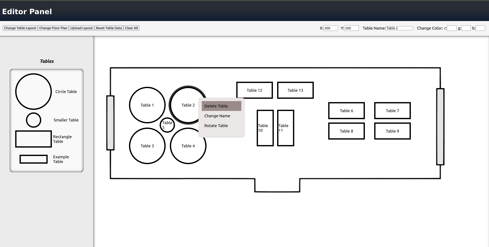

# Floor Plan Editor

Originally created as part of a much larger project for my job but was scrapped due to a change in project scope. Due to my involvement with the editor feature, I was given full ownership of the code and have been given permission to present this on my github. All code found in this repository is my own. 

Since this was originally part of a much larger codebase some functionality is broken or has been removed. The major portion is in the save functionality and database connection. I am currently working on adding the functionality back and integrating it with a new database/backend. This backend will be built using Node with express and the database will be using postgres. As it was originally made using a serverless architecture with a non-relational database this will take me some time to complete. Additionally I'm working on migrating the project to Typescript which will make the code much easier to work with in the long run.

Other changes will involve updating the styling, adding color changing back to the tables, allowing users to increase table size, multi table selection, and copy/paste functionality. 

I am also considering to change the project into a mind map tool. I don't have a personal need for a floorplan editor but a mind map tool would be nice. The code itself is already fairly set up for it.

This is how the editor currently appears

Some notable features include:
- undo/redo functionality (Ctrl + z, Ctrl + y)
- drag and drop for easy table creation
- tables snap to grid while dragging, for easy placement (Snap to grid while dragging took me an entire week to implement, much harder than it looks)
  - Use the arrow keys while a table is selected to finetune placement (sidenote the delete key will delete a selected table)
- Functioning context menu for quick table editing

## Features that need to be re-added
- file sytem to save and load layouts from a database 
- auto save to localstorage so users don't lose progress when closing tabs
- Color changing (Was originaly going to be changed so that the table would light up a certain color when selected by a user)

## Features that need to be added
- Size slider for the tables
- Copy and paste ability
- Multi table selection (So you can copy/move large groups of tables all at once)
- Screen panning + zoom in/zoom out      

## Things that need to be changed
- The way table numbers are created
  - Currently they're done automatically which is confusing to a user (was fun to implement though) so I want to make it manual with warnings.
- Convert all javascript to typescript
- Make better use of State Management.
  - While I use Context when neccesary, I didn't learn about it until about halfway through the project so there's a lot of things I could have done better. It's not that bad though so I'll keep a lot of it for now. Might look into Redux/Remix but Context seems to work.
- Create standardized styling solution (likely use css modules)
- Create standardized commenting system for main components and functions

